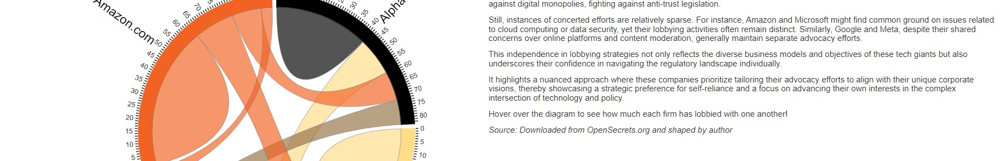
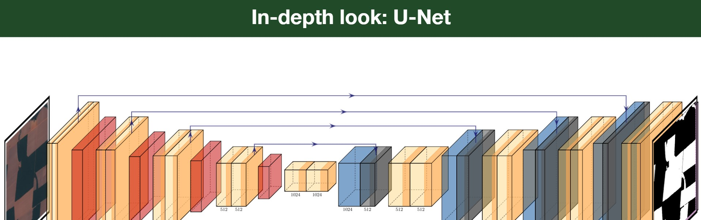
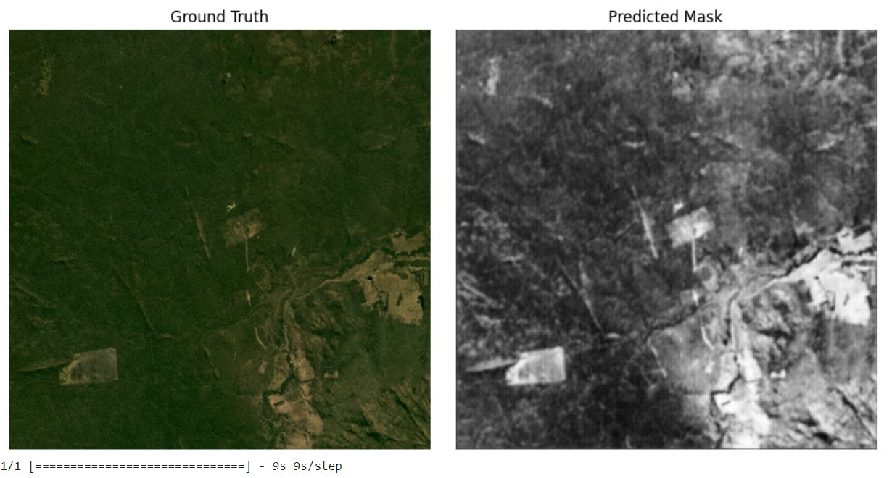
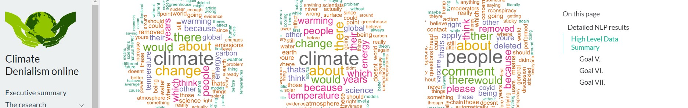

```{r setup, include=FALSE}
knitr::opts_chunk$set(echo = FALSE)
knitr::opts_chunk$set(warning = FALSE, message = FALSE) 
```


# Intro 


<div style="display: flex; align-items: center;">
  
  <div style="font-family: Arial, sans-serif; font-size: 100px;">
    
    I’m a freshly-minted Data Scientist, straight out of my Master’s in Data Science for Public Policy from Georgetown’s McCourt School.
    
    These days, you’ll find me at the World Bank, working my data magic for Data360, where I help turn curate data that is used by millions across the globe. 
    
    Read on to learn more about me! 
    
  </div>
</div>

<br>
<br>

Psst...let's connect on other platforms! <br>
* [LinkdIn](https://www.linkedin.com/in/sanha-tahir/) <br>
* [Resume](https://drive.google.com/file/d/17ShM02-q6ppX-REgj6Ba7aSo9Hy3u_cG/view?usp=sharing) <br>

<br>

<left>

</left>

# Skills

<br>

The question you might ask is, _why should we hire you?_

Well, here's all the treasure trove of skills I can bring to the table: 

``` {r, fig.height=3, fig.width=10}

library(plotly)

# Example Data
skills_data <- read.csv("../../assets/tables/skills.csv")

# Add jitter to x and y values
set.seed(123)  # For reproducibility
skills_data$x_jitter <- (skills_data$x) + runif(nrow(skills_data), -0.2, 0.2)  # Adjust range as needed
skills_data$y_jitter <- (skills_data$y/10) + runif(nrow(skills_data), -0.2, 0.2)  # Adjust range as needed
skills_data$text_combined <- paste("Language:", skills_data$parent, "<br>", "Subskill:", skills_data$subskills)


# Create the plot with a dropdown menu for tags
fig <- plot_ly(
  skills_data, 
  x = ~x_jitter, 
  y = ~y_jitter, 
  text = ~text_combined, 
  type = 'scatter', 
  mode = 'markers',
  marker = list(
    size = ~expertise_score, 
    opacity = 0.9,
    color = "#FFB3BA",  # Map color from 'color' column
    line = list(width = 0.5)
  )
)

# Generate dropdown buttons for each unique tag
unique_tags <- unique(skills_data$tags)
buttons <- lapply(unique_tags, function(tag) {
  list(
    method = "restyle",
    args = list("transforms[0].value", tag),  # Filter based on tag
    label = tag
  )
})

# Add an "All" button to show all tags
#  <- c(list(list(method = "restyle", args = list("transforms[0].value", NULL), label = "All")), buttons)

# Add dropdown menu with buttons to filter by tag
fig <- fig %>%
  layout(
    title = list(
      text = 'What do I bring to the table?',
      x = 0.5,  # Center the title
      xanchor = "center",
      yanchor = "top",
      font = list(size = 20),
      pad = list(t = 1)  # Reduce top padding around title
    ),
    xaxis = list(
      showgrid = FALSE,
      zeroline = FALSE,
      showticklabels = FALSE,
      title = "",
      range = c(min(skills_data$x) - 1, max(skills_data$x) + 1),  # Compress x-axis range
      scaleanchor = "y"  # Link x-axis scale to y-axis for equal scaling
    ),
    yaxis = list(
      showgrid = FALSE,
      zeroline = FALSE,
      showticklabels = FALSE,
      title = "",
      range = c(min(skills_data$y) - 1, max(skills_data$y) + 1)  # Compress y-axis range
    ),
    updatemenus = list(
      list(
        y = 0.7,  # Position dropdown
        x = 1,
        buttons = buttons
      )
    )
  ) 

fig <- fig %>%
  add_trace(
    transforms = list(
      list(
        type = "filter",
        target = ~tags,
        operation = "=",
        value = unique_tags[1]  # Default to first tag
      )
    ),
    marker = list(
      color = "#BAE1FF"  # Light pink color for this trace
    )
  )


fig
```

Most important of all is this however: 

```{r, echo=FALSE, fig.height=4, fig.width=4}

data <- data.frame(
  label = "Skill: Enthusiasm <br> Subskill: Ready to learn and take on new challenges",
  x = 1,
  y = 1,
  size = 200  # Adjust size to control bubble size
)

# Create the bubble chart
fig <- plot_ly(
  data,
  x = ~x,
  y = ~y,
  text = ~label,
  type = 'scatter',
  mode = 'markers',
  marker = list(
    size = ~size,
    opacity = 0.7,
    color = '#FFDFBA'  # Set color for the bubble
  )
)

# Customize layout if needed
fig <- fig %>% layout(
  title = "My Biggest Asset",
  xaxis = list(showgrid = FALSE, zeroline = FALSE, showticklabels = FALSE, 
               title = "",
               range = c(min(data$y) - 1, max(data$y) + 1)),
  yaxis = list(showgrid = FALSE, zeroline = FALSE, showticklabels = FALSE, title = "",
               range = c(min(data$y) - 1, max(data$y) + 1))
)

fig

```

There will always be some knowledge and skills that I am not well-versed in, situations where I am unaware of proceedings...but this does not deter me. In fact, I am driven to learn new things and push myself out of my comfort zone; an invaluable asset for anyone I work with! 
<br>


<left>

</left>

# Experience

```{r, echo = FALSE, fig.height=6, fig.width=10}
library(plotly)
job_exp_data <- read.csv("../../assets/tables/job_exp.csv")
job_exp_data$size <- 9.5 * (job_exp_data$duration_months + (12*job_exp_data$duration_years))
job_exp_data$year_standard <- (job_exp_data$start_year - 2020)
job_exp_data$text_combined <- paste("Title:", job_exp_data$title, 
                                    "<br>", "Skills:", job_exp_data$skills,
                                    "<br>", "Overview:", job_exp_data$text)

custom_colors <- c("#FFB3BA", "#FFDFBA", "#BAFFC9", "#BAE1FF", "#B8A0D3", "#F6A8A1") 

# Initialize the plot with the grey line only
fig <- plot_ly() %>%
  layout(
    shapes = list(
      list(
        type = "line",
        y0 = 0, y1 = 0,
        x0 = min(job_exp_data$year_standard) - 0.8,
        x1 = max(job_exp_data$year_standard) + 0.3,
        line = list(color = "grey", width = 1, dash = "dot")
      )
    )
  )

# Add bubble chart on top of the grey line
fig <- fig %>%
  add_trace(
    data = job_exp_data,
    x = ~year_standard,
    y = ~x,
    text = ~text_combined,
    type = 'scatter',
    mode = 'markers',
    marker = list(size = ~size, 
                  opacity = 1,
                  color = custom_colors,
                  line = list(width = 0))
  )

# Customize layout
fig <- fig %>% layout(
  
    title = list(
      text = 'My Journey In The Work Force Over The Years...',
      x = 0.5,  # Center the title
      xanchor = "center",
      yanchor = "top",
      font = list(size = 20),
      pad = list(t = 1)  # Reduce top padding around title
    ),
  xaxis = list(
    showgrid = FALSE,
    zeroline = FALSE,
    showticklabels = FALSE,
    title = "",
    range = c(min(job_exp_data$year_standard) - 1, max(job_exp_data$year_standard) + 1),  # Compress x-axis range
    scaleanchor = "y"  # Link x-axis scale to y-axis for equal scaling
  ),
  yaxis = list(
    showgrid = FALSE,
    zeroline = FALSE,
    showticklabels = FALSE,
    title = "",
    range = c(min(job_exp_data$x) - 1, max(job_exp_data$x) + 1)  # Compress y-axis range
  )
)

fig

```

Throughout my career, I’ve had the opportunity to work across diverse roles and environments, each bringing new perspectives and challenges. Yet, two themes have remained constant: <br>

1. A Commitment to Policy Impact – I’m deeply driven by the desire to create positive change through data-driven policy. Whether I’m developing new data insights or working hands-on with stakeholders, my ultimate goal is to contribute to meaningful and informed policy decisions. <br>

2. A Passion for Data and Collaboration – Data is my foundation, but connecting with people is what brings my work to life. I thrive in roles where I can not only analyze data but also engage directly with teams and partners to communicate insights, build solutions, and foster shared understanding.

<br>
<left>

</left>

# Education

<div style="display: flex; align-items: center;">
  
  <div style="font-family: Arial, sans-serif; font-size: 100px;">
    
    MS – Data Science And Public Policy, Georgetown University						
    Aug 22–May 24
    
    Accolades: 
    Tech & Public Policy Scholar (100% Scholarship and RAship)
    
    Leadership Positions: 
    1. Data Science and Public Policy Representative (McCourt Student Association) 
    2. Data Science Bootcamp Leader

  </div>
</div>

<div style="display: flex; align-items: center;">
  
  <div style="font-family: Arial, sans-serif; font-size: 100px;">
    
    BSc – Economics and Mathematics, Lahore University of Management Sciences					
    Aug 16–May 20
    
    Accolades: 
    1. Valedictorian (Class of 2020)
    2. Dean's Honor List (2016-2019)
    3. Best Presented Paper in Category "Structural Transformation", South Asian Economics Students' Meet, 2023 (Colombo, Sri Lanka)
    
    Leadership Positions: 
    1. Vice President, LUMS Daily Student
    2. Peer Mentor
    3. Teaching Assistants

  </div>
</div>


<left>

</left>


# Projects 

With a variety of projects under my belt, I’ve gained valuable experience and insights across different domains. <br>

Let’s dive in and explore some highlights...

## [Investigating the Lobbying Landscape on Capitol Hill](https://drive.google.com/file/d/1Mm1LeqtV8ft6rHGbxKcOMCKu-SOyxmjX/view?usp=sharing)


<left>

</left>

I became interested in how large companies play a role in the policies that govern our every daily lives. <br> 
The questions I was curious about were: <br> 
1. To what extent do these companies influence the bills that pass through Congress?  <br> 
2. Who are the large players in this context, and which issues are most important to them?  <br>  
3. Are there instances where these companies work together on several bills, related to a certain field?  <br> 
4. Are there other patterns? For example, are some companies more prone to providing support to a certain party to propel their interests? <br> 

To answer these, I scraped data provided by [OpenSecrets.org](https://www.opensecrets.org/) to get information about Congressional bills and their sponsors. I then merged the data with other details about the bill, and finally performed some detailed data analysis. <br>

* [Write-up with detailed Analysis](https://drive.google.com/file/d/1Mm1LeqtV8ft6rHGbxKcOMCKu-SOyxmjX/view?usp=sharing)
* [Github](https://github.com/sanhatahir/lobbying_congress)


Skills used:  <br> 
* Web Scraping <br> 
* Data manipulation <br> 
* PCA & Cluster Analysis using K-Means <br> 
* Network Analysis using networkx <br> 

I was also deeply interested in the role big technology firms play in lobbying. Are there certain policy areas where they are more active, e.g. internet regulation? Do they collaborate on a large number of bills, or not? For that purpose, I made a specific dashboard that highlights the results here:   <br>

* [Viz](https://sanhatahir.shinyapps.io/Final_Project/) <br>

Lastly, I wanted to present my findings in an interesting and engaging way. What better way to do that, than in a game?! <br>
In this, I made a Shiny application where the user is provided 'hints' in the form of data visualizations, and they have to guess which firm is being talked about. <br>
The idea was to get users to think about the many different ways these firms are affecting the policies that govern our lives.

* [Game](https://sanhatahir.shinyapps.io/Guess_The_Firm/)

Skills used:  <br> 
* Shiny <br> 
* Plotly <br>


## Deforestation 

<left>

</left>

Carbon emissions driving global warming have led to significant changes worldwide, including accelerated deforestation in Bolivia. <br>

To quantify this, we analyzed satellite images from the past seven years, applying image segmentation to pinpoint deforested areas in detail. Using a U-Net convolutional encoder-decoder model, originally developed for medical imaging but highly effective in forestry segmentation (achieving ~94% accuracy), we created binary forest/non-forest masks for high-resolution satellite images from Planet and estimated deforestation rates. <br> 


<left>

</left>

The U-Net architecture enabled feature extraction and mask creation by compressing spatial information and then reconstructing detailed classifications. After masking test data images, we calculated the forested area percentage for each region, finding the most significant change around quad ‘680-930’ (16.21° S, 63.37° W). Future work could explore more nuanced classifications beyond binary segmentation.


Final Outputs: 
* [Slides](https://docs.google.com/presentation/d/1ZzxnB3HvzOuNMEJ3FB03e7kHFoxAgqlJ/edit?usp=sharing&ouid=117544413816913004630&rtpof=true&sd=true)
* [Github](https://github.com/sanhatahir/dsan6600_group_project)


Skills used:  <br> 
* tensorflow <br>
* keras <br>
* matplotlib <br>

## [Understanding Climate Denialism in Reddit on AWS:](https://gu-ppol.github.io/spring-2024-reddit-bigdata-project-team-03/w1_exec.html) 

<left>

</left>

As part of a group project, I conducted an analysis of climate-related misinformation on Reddit, focusing on various subreddits to address specific policy-related questions, using AWS as a computational platform. <br>

Our approach involved comparing techniques like data oversampling and undersampling to address class imbalances, along with Logistic Regression and XGBoost for the classification of climate denialism. <br>

Leveraging PyTorch and the Simple Transformers library, we loaded a pre-trained RoBERTa model to classify climate denial claims effectively. <br> 

We created visualizations to highlight key metrics, ensuring clear communication of technical findings to non-technical stakeholders. Additionally, we conducted a network analysis to identify key contributors and super-spreaders of climate denial claims, providing insights into the patterns of misinformation spread.

Final Results: 

* [Github](https://github.com/gu-ppol/spring-2024-reddit-bigdata-project-team-03) <br>
* [Website](https://gu-ppol.github.io/spring-2024-reddit-bigdata-project-team-03/w1_exec.html) <br>

Skills used:  <br> 
* AWS S3 Buckets <br>
* Amazon ECS & Docker <br>
* PySpark <br>
* Pytorch <br>
* R Markdown <br> 
* Networkx <br>
* ggplot <br>
* matplotlib 

